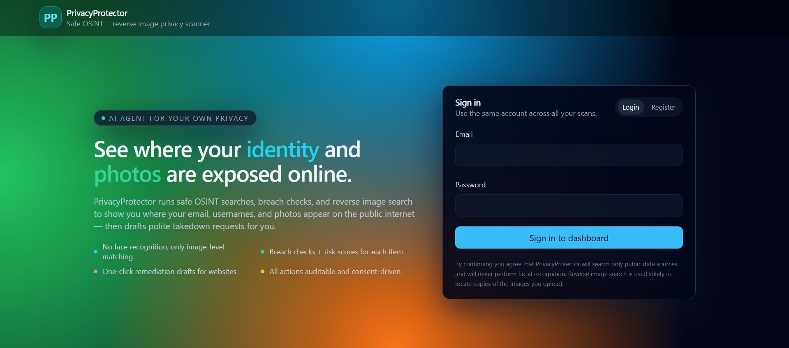
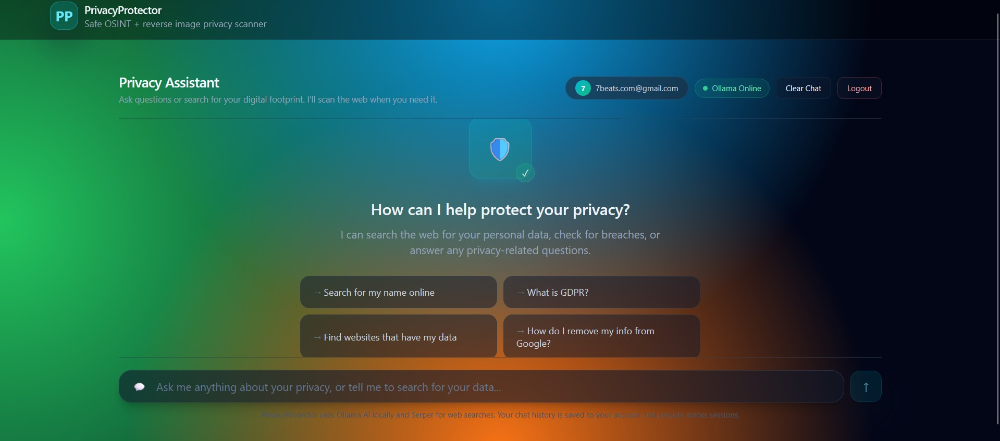
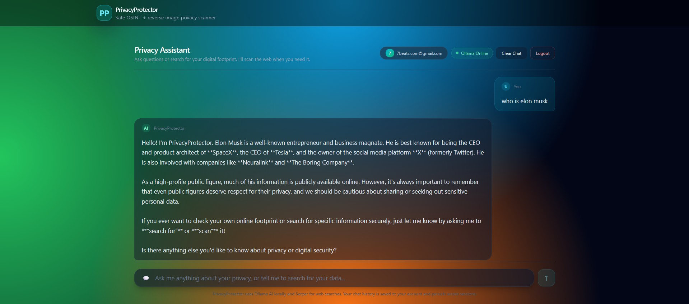

# 🛡️ PrivacyProtector



**AI-powered privacy scanner that finds where your personal data is exposed online.**

PrivacyProtector is a full-stack web application that acts as your personal privacy agent. It uses a conversational chat interface where you can ask privacy-related questions or request web searches to discover where your name, email, photos, and other personal data appear on the public internet — then helps you take action with risk scoring and remediation drafts.

---

## ✨ Key Features

- **🤖 AI Chat Assistant** — Ask any privacy question and get expert answers powered by a local LLM (Ollama)
- **🔍 Web Search Scanning** — Search the web for your personal data using Serper (Google Search API) with real-time results
- **⚡ Risk Classification** — Every finding is scored for privacy risk (High / Medium / Low) with evidence and rationale
- **📧 Remediation Drafts** — Auto-generate takedown request emails for websites exposing your data
- **🔒 Local-First AI** — All AI inference runs locally via Ollama — your data never leaves your machine
- **🔐 Auth & Consent** — JWT-based authentication with explicit consent before any scanning

---

## 📸 See It In Action

### Privacy Assistant Dashboard
The main interface where you can chat with the AI, run privacy scans, and see risk-labeled results.



### AI Explaining Privacy Concepts
The local LLM can answer complex privacy questions like "What is GDPR?" or "Who is Elon Musk" safely and locally.



### Real-Time Video Demo
Watch the AI scan the web, classify findings by risk level, and display actionable results.

[](https://github.com/Kedareswar13/Privacy_Protector/blob/main/assets/Chat_log.mp4)

*(Click the image above to watch the full video demo!)*

---

## 🏗️ Tech Stack

| Layer | Technology |
|-------|-----------|
| **Frontend** | Next.js 14, React 18, TailwindCSS, TypeScript |
| **Backend** | Python 3.11+, FastAPI, Uvicorn |
| **Database** | SQLite (dev) / PostgreSQL (prod) via SQLModel |
| **LLM** | Ollama (local) — qwen3.5:latest |
| **Web Search** | Serper.dev (Google Search API) |
| **Auth** | JWT (python-jose) |

---

## 📁 Project Structure

```
PrivacyProtector/
├── .env                        # Environment variables (secrets, API keys)
├── .env.example                # Template for .env
├── .gitignore                  # Git ignore rules
├── DECISIONS.md                # Architecture decisions log
├── README.md                   # This file
│
├── docs/
│   └── architecture.md         # System architecture & data flow diagrams
│
├── backend/                    # FastAPI Python backend
│   ├── requirements.txt        # Python dependencies
│   ├── datasteward.db          # SQLite database (auto-created)
│   ├── .venv/                  # Python virtual environment
│   │
│   └── app/
│       ├── main.py             # FastAPI app entry point, CORS, router registration
│       │
│       ├── api/                # REST API route handlers
│       │   ├── __init__.py
│       │   ├── auth.py         # POST /auth/register, POST /auth/login (JWT)
│       │   ├── chat.py         # POST /chat — main conversational endpoint
│       │   ├── consent.py      # POST /consent — explicit consent management
│       │   ├── items.py        # POST /items/{id}/action — remediation for items
│       │   ├── mcp.py          # GET /mcp/tools, POST /mcp/call — MCP tool registry
│       │   ├── planner.py      # POST /planner/plan — debug planner output
│       │   └── scans.py        # POST /scans, GET /scans/{id}, POST /scans/{id}/run
│       │
│       ├── core/               # Business logic & shared services
│       │   ├── auth_utils.py   # Password hashing, JWT creation/verification
│       │   ├── ollama_client.py # Ollama HTTP client (chat, JSON, availability check)
│       │   ├── planner_service.py # LLM-based scan planner (Ollama)
│       │   ├── planner_fewshots.json # Few-shot examples for the planner
│       │   ├── pseudonymize.py # HMAC-based identifier pseudonymization
│       │   └── scan_runner.py  # Orchestrates scan: planner → tools → classify → store
│       │
│       ├── db/                 # Database layer
│       │   ├── models.py       # SQLModel tables: User, Consent, Scan, Item, ToolCall
│       │   └── session.py      # Engine setup, SQLite/Postgres fallback, session factory
│       │
│       └── mcp_tools/          # MCP tool implementations
│           ├── __init__.py
│           ├── search_web.py       # Serper.dev Google Search integration
│           ├── search_social.py    # Social platform search (stubbed)
│           ├── check_breach.py     # HIBP breach check (stubbed)
│           ├── reverse_image_search.py # Reverse image lookup (stubbed)
│           ├── classify_items.py   # LLM risk classification via Ollama
│           ├── score_risk.py       # Rule-based risk scoring
│           ├── generate_remediation.py # LLM remediation draft via Ollama
│           └── reader_fewshots.json    # Few-shot examples for the classifier
│
└── frontend/                   # Next.js React frontend
    ├── package.json            # Node dependencies & scripts
    ├── next.config.mjs         # Next.js configuration
    ├── tailwind.config.mjs     # TailwindCSS dark theme & design tokens
    ├── postcss.config.mjs      # PostCSS configuration
    ├── tsconfig.json           # TypeScript configuration
    │
    ├── app/                    # Next.js App Router pages
    │   ├── globals.css         # Global styles & gradient background
    │   ├── layout.tsx          # Root layout with header & navigation
    │   ├── page.tsx            # Login / Register page (landing)
    │   ├── dashboard/
    │   │   └── page.tsx        # Chat-based Privacy Assistant dashboard
    │   └── scans/
    │       └── [id]/
    │           └── page.tsx    # Individual scan item detail page
    │
    ├── components/
    │   └── ui/                 # Reusable UI primitives
    │       ├── button.tsx      # Button component (variants: default, outline, ghost)
    │       ├── card.tsx        # Card, CardHeader, CardContent, CardTitle, etc.
    │       ├── input.tsx       # Styled input field
    │       └── label.tsx       # Form label component
    │
    └── lib/
        ├── api.ts              # API client (fetch wrapper, auth, chat, scans)
        └── cn.ts               # Tailwind class merge utility
```

---

## 📄 File-by-File Explanation

### Backend — `backend/app/`

| File | Purpose |
|------|---------|
| **`main.py`** | Creates the FastAPI app, configures CORS (allows `localhost:3000`), registers all routers, and initializes the database on startup. |
| **`api/auth.py`** | Handles user **registration** (hashes password, stores in DB) and **login** (verifies password, returns JWT token). |
| **`api/chat.py`** | The **primary endpoint**. Accepts a conversation history, detects whether the user wants a general answer or a web search using regex-based intent detection, then routes to Ollama (general Q&A) or Serper+Ollama (search + classify). Returns a reply and optional structured search results with risk scores. |
| **`api/consent.py`** | Stores explicit user consent for scanning operations (required before scans). |
| **`api/scans.py`** | CRUD for scans — create a scan with seed data (name, email, image hash), trigger a scan run, retrieve results and items. |
| **`api/items.py`** | Actions on individual items — currently supports "draft_email" to generate a remediation email via Ollama. |
| **`api/mcp.py`** | MCP tool registry — lists available tools with JSON schemas, and provides a generic `/mcp/call` endpoint to invoke any tool with validated arguments. |
| **`api/planner.py`** | Debug endpoint to test the planner — accepts a state object and returns a JSON plan of tool calls. |
| **`core/ollama_client.py`** | Reusable async HTTP client for the local Ollama server. Provides `chat_completion()` (returns text), `chat_completion_json()` (returns parsed JSON), and `is_available()`. Strips `<think>` tags that qwen3.5 produces. Timeout: 300s. |
| **`core/planner_service.py`** | Uses Ollama to decide which MCP tools to call for a given scan. Few-shot prompted. Falls back to deterministic mock planning if Ollama is unavailable. |
| **`core/scan_runner.py`** | Orchestrates a full scan: calls the planner → executes tool calls → stores results as Items → runs LLM classification → updates risk scores. |
| **`core/auth_utils.py`** | SHA256 password hashing, JWT encode/decode, and FastAPI dependency for extracting the current user from Bearer tokens. |
| **`core/pseudonymize.py`** | HMAC-SHA256 based pseudonymization of identifiers before sending to LLMs. Produces stable tokens like `USER_a1b2c3d4e5`. |
| **`db/models.py`** | SQLModel table definitions: `User`, `Consent`, `Scan`, `Item`, `ToolCall`. |
| **`db/session.py`** | Database engine setup. Loads `.env` from project root. Falls back to SQLite (`datasteward.db`) if no `DATABASE_URL` is set. |
| **`mcp_tools/search_web.py`** | Calls the Serper.dev API for Google Search results. Returns title, snippet, URL, and date for each result. Falls back to mock data if no API key. |
| **`mcp_tools/classify_items.py`** | Sends scan items to Ollama for privacy risk classification. Returns category, risk_score (0–1), rationale, evidence citations, and verifiability. Falls back to rule-based scoring. |
| **`mcp_tools/generate_remediation.py`** | Generates data removal request emails and step-by-step remediation plans via Ollama. Falls back to a template if unavailable. |
| **`mcp_tools/score_risk.py`** | Simple rule-based risk scoring using category weights × confidence. |
| **`mcp_tools/check_breach.py`** | HIBP breach check — currently returns empty results (needs `HIBP_API_KEY`). |
| **`mcp_tools/search_social.py`** | Social platform search — stubbed, returns empty (needs `GITHUB_TOKEN`). |
| **`mcp_tools/reverse_image_search.py`** | Reverse image lookup — stubbed, returns empty (needs real API). |

### Frontend — `frontend/`

| File | Purpose |
|------|---------|
| **`app/layout.tsx`** | Root layout — sets dark mode, gradient background, header with PrivacyProtector branding. |
| **`app/page.tsx`** | **Landing page** — login/register form with JWT auth. Stores token in `localStorage` and redirects to `/dashboard`. |
| **`app/dashboard/page.tsx`** | **Chat Dashboard** — the main interface. Chat bubbles for user/AI messages, inline search results with risk color coding (🔴 High, 🟡 Medium, 🟢 Low), typing indicators, quick-action suggestion buttons, chat history persistence in `localStorage`. |
| **`app/scans/[id]/page.tsx`** | **Item Detail** page — shows full metadata for a single scan finding. |
| **`components/ui/*.tsx`** | Reusable UI primitives (Button, Card, Input, Label) with consistent dark theme styling. |
| **`lib/api.ts`** | API client — typed fetch wrapper with JWT auth support. Functions: `login`, `register`, `createConsent`, `createScan`, `runScan`, `getScanItems`, `getItem`, `sendChat`. |
| **`lib/cn.ts`** | Utility for merging TailwindCSS class names (uses `tailwind-merge` + `clsx`). |

---

## 🚀 Getting Started

### Prerequisites

| Requirement | Version | Notes |
|-------------|---------|-------|
| **Python** | 3.11+ | For the FastAPI backend |
| **Node.js** | 18+ | For the Next.js frontend |
| **Ollama** | Latest | Local LLM server — [install from ollama.com](https://ollama.com) |

### 1. Clone & Setup Environment

```bash
git clone https://github.com/Kedareswar13/Privacy_Protector.git
cd PrivacyProtector

# Copy environment template
cp .env.example .env
# Edit .env with your SERPER_API_KEY (get free key at https://serper.dev)
```

### 2. Install & Start Ollama

```bash
# Install Ollama (if not already installed)
# Download from https://ollama.com

# Pull the model
ollama pull qwen3.5

# Ollama server starts automatically, or run:
ollama serve
```

### 3. Start the Backend

```powershell
cd backend

# Create virtual environment (first time only)
python -m venv .venv

# Activate venv
.venv\Scripts\activate        # Windows
# source .venv/bin/activate   # macOS/Linux

# Install dependencies
pip install -r requirements.txt

# Start the server
python -m uvicorn app.main:app --host 0.0.0.0 --port 8000 --reload
```

> Backend runs at **http://localhost:8000** — check health at `/health`

### 4. Start the Frontend

```powershell
cd frontend

# Install dependencies (first time only)
npm install

# Start dev server
npm run dev
```

> Frontend runs at **http://localhost:3000**

### 5. Use the App

1. Open **http://localhost:3000**
2. **Register** a new account or **Login**
3. Start chatting with the **Privacy Assistant**:
   - Ask general questions → *"What is GDPR?"*, *"How do I remove my info from Google?"*
   - Request web searches → *"Search for my name online"*, *"Find websites that have my data"*
4. Review search results with **risk labels** and **evidence**

---

## 🔧 Configuration

All configuration is in the `.env` file at the project root:

| Variable | Required | Description |
|----------|----------|-------------|
| `OLLAMA_BASE_URL` | Yes | Ollama server URL (default: `http://localhost:11434`) |
| `OLLAMA_MODEL` | Yes | LLM model name (default: `qwen3.5:latest`) |
| `SERPER_API_KEY` | Yes* | Serper.dev API key for web searches (*falls back to mock without it) |
| `JWT_SECRET` | Yes | Secret key for signing JWT tokens |
| `DATABASE_URL` | No | PostgreSQL connection string (defaults to local SQLite) |
| `HIBP_API_KEY` | No | HaveIBeenPwned API key for breach checks |
| `GITHUB_TOKEN` | No | GitHub personal access token for social search |
| `MOCK_CONNECTORS` | No | Set to `true` to use mock data for all external APIs |
| `PSEUDONYM_SALT` | No | Salt for pseudonymizing identifiers before LLM calls |

---

## 🔄 How It Works

### Chat Flow (Primary User Interaction)

```
User types message
    │
    ▼
Backend /chat endpoint
    │
    ├── Intent Detection (regex patterns)
    │
    ├── General Question?
    │   └── Send conversation to Ollama → Return AI answer
    │
    └── Search Request?
        ├── Extract search query
        ├── Call Serper API → Get Google Search results
        ├── Classify each result with Ollama (risk score, rationale)
        ├── Generate natural language summary with Ollama
        └── Return summary + structured search results with risk labels
```

### Scan Flow (Programmatic)

```
Create scan (seeds: name, email, image_hash)
    → Planner (Ollama) produces tool-call plan
    → Execute tools (searchWeb, checkBreach, reverseImageSearch)
    → Classify all findings with Ollama
    → Store results as Items in DB
    → Return structured report
```

---

## 📡 API Endpoints

| Method | Endpoint | Description |
|--------|----------|-------------|
| `GET` | `/health` | Health check |
| `POST` | `/auth/register` | Create account (email + password) |
| `POST` | `/auth/login` | Login → JWT token |
| `POST` | `/consent` | Record user consent (requires auth) |
| `POST` | `/chat` | **Main chat** — general Q&A or web search |
| `POST` | `/scans` | Create a new scan |
| `GET` | `/scans/{id}` | Get scan status |
| `POST` | `/scans/{id}/run` | Execute scan pipeline |
| `GET` | `/scans/{id}/items` | List scan findings |
| `GET` | `/scans/items/{id}` | Get single item details |
| `POST` | `/items/{id}/action` | Generate remediation for an item |
| `GET` | `/mcp/tools` | List all MCP tools with schemas |
| `POST` | `/mcp/call` | Call a specific MCP tool |
| `POST` | `/planner/plan` | Debug: get planner output for a state |

---

## 🔒 Security & Privacy

- **Local-first AI** — Ollama runs on your machine; no conversation data goes to cloud APIs
- **Pseudonymization** — Personal identifiers are HMAC-hashed before LLM processing
- **Explicit consent** — Users must opt-in before scanning begins
- **No face recognition** — Reverse image search uses file-hash matching only
- **JWT auth** — Stateless token authentication with configurable expiry
- **Serper queries only** — The only external API calls are search queries to Serper.dev

---

## 📝 License

This project is for educational and personal use.
